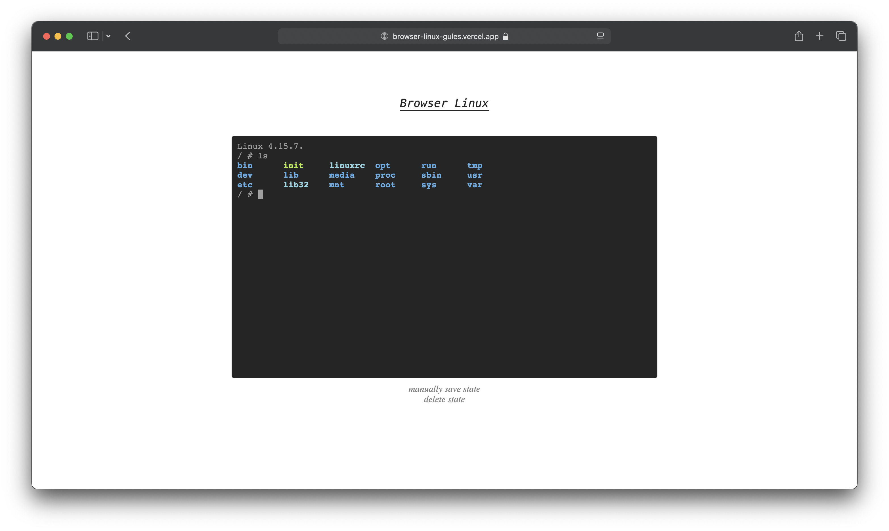

<h1 align="center">Linux shell in browser.</h1>

_**Demo:**_ [**browser-linux.tanishqsingh.com**](https://browser-linux.tanishqsingh.com).

When you open this first time, linux iso and some bios file has to be dowload which is less than 10 mb,
After which stores the vm state in [cache storage](https://developer.mozilla.org/en-US/docs/Web/API/Cache)
and reboots will be nearly instant.

-   VM State keeps on `saving` automatically every `10 seconds`.
-   There are buttons to manually `save` / `delete` vm state.

Made possible with [copy/v86](https://github.com/copy/v86), [humphd/browser-shell](https://github.com/humphd/browser-shell), [xterm](https://github.com/xtermjs/xterm.js), and [Vite](https://vite.dev).

---

more project? [_**threejs journey**_](https://github.com/tanishq-singh-2407/threejs-journey).
